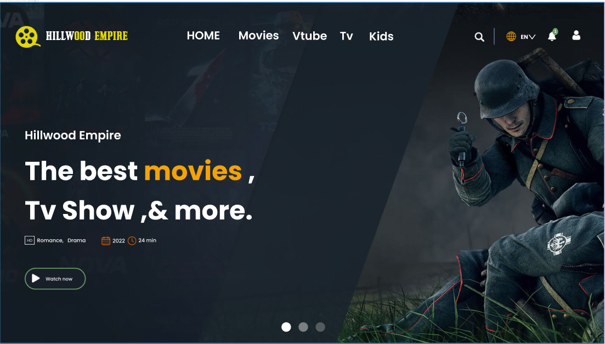

# 📖 HillWood Empire <a name="about-project"></a>

> HillWood-Empire" is an online streaming platform that provides users with a diverse selection of movies, TV shows, videos, and content for kids. It is a subscription-based service that allows users to access the platform on various devices, including smartphones, tablets, laptops, and smart TVs.


<div align="center">
  <!-- You are encouraged to replace this logo with your own! Otherwise you can also remove it. -->
  
  <br/>
  <!-- <h3><b>HillWood Empire</b></h3> -->
</div>


### Tech Stack <a name="tech-stack"></a>

<details>
  <summary>Backend - Dashboard</summary>
    <li><a href="#">Ruby</a></li>
    <li><a href="#">Ruby on Rails</a></li>
    <li><a href="https://github.com/activeadmin/activeadmin">Active Admin</a></li>
    <li><a href="https://github.com/ayann/active_admin_flat_skin">ActiveAdminFlatSkin</a></li>
    <li><a href="https://github.com/activeadmin/activeadmin/wiki/Themes">Themes</a></li>

  </ul>
</details>

<details>
  <summary>Links </summary>
  <ul>
    <li><a href="https://drawsql.app/teams/chaw-1/diagrams/hillwood-backend2">ERD Diagram</a></li>
    <li><a href="#">Version 1 features</a></li>
  </ul>
</details>

</details>

### Key Features <a name="key-features"></a>

- Project setup 😊
- App Api Integration 💯
- Customer Admin Dashboard.🚀
- Authentication Api and Admin Dasborad configuration 👌
- User Authorization and permission 😃👍

<p align="right">(<a href="#readme-top">back to top</a>)</p>

## 💻 Getting Started <a name="getting-started"></a>

### Prerequisites

In order to run this project you need:

- A web browser to view output e.g [Google Chrome](https://www.google.com/chrome/).
- An IDE e.g [Visual studio code](https://code.visualstudio.com/).
- Install the `npm` package manager use this [to install both node and npm](https://docs.npmjs.com/downloading-and-installing-node-js-and-npm).
- [A terminal](https://code.visualstudio.com/docs/terminal/basics).


### Create the database & Starting up the Web Server

```bash
$   rails db:create db:migrate
$   rails server

// or you can run additionaly this to precompile  tailwind asset and start the server

$ bin/dev
```

### Install

To install all dependencies, run:

```
 $ npm run install
 $ npm run dev
```

### Usage

To run the project, follow these instructions:

- After Cloning this repo to your local machine.
- To get it running on your default browser and local host, run:

1. Open the index with live server from the code editor
2. Or you can double click on the index to open it in the browser

### Run tests

To run tests, run the following command:

- Track Ruby and css linter errors run:

```
$ rubocop -A
$ rubocop --auto-correct-all
$ npx stylelint "**/*.{css,scss}"
```
- Kill the server

```
$ kill -9 PID
$ pkill -f "ruby"
$ rm tmp/pids/server.pid
```

<p align="right">(<a href="#readme-top">back to top</a>)</p>

## 🎥 Future Feature <a name="future feature"></a>

- 


## 🎥 Project Presentation

- Project Presentation: will add soon

<p align="right">(<a href="#readme-top">back to top</a>)</p>

## Contributors

👤 **Ben Mukebo**

- GitHub: [@Ben Mukebo](https://github.com/benmukebo)
- Twitter: [@Ben Mukebo](https://twitter.com/BenMukebo)

Contributions, issues, and feature requests are welcome!

## Show your support

Give a ⭐️ if you like this project!


## 🤝 Contributing <a name="contributing"></a>

Contributions, issues, and feature requests are welcome!

Feel free to leave any suggestions at the [Issues page](https://github.com/BenMukebo/hillwood-backend-dashboard/issues)

<p align="right">(<a href="#readme-top">back to top</a>)</p>


- The original design ideal from Feli Technology 💕.

## 📝 License <a name="license"></a>

This project is [Apache-2.0 license](./LICENSE.MD) licensed.

<p align="right">(<a href="#readme-top">back to top</a>)</p>
